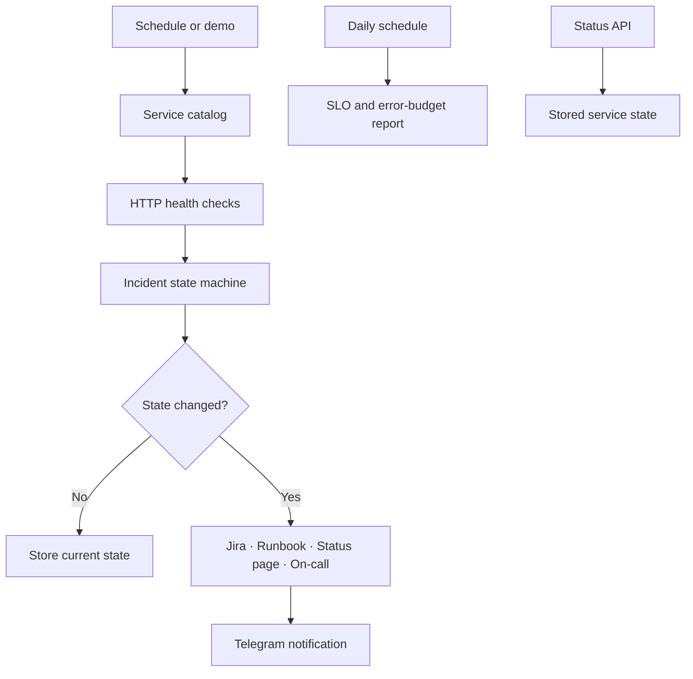

# PulseOps — API Reliability Control Tower

[Русская версия](README_RU.md) · [Architecture](docs/ARCHITECTURE.md) · [Setup](docs/SETUP.md) · [Data contracts](docs/DATA_CONTRACTS.md)

An n8n workflow for API health monitoring, incident lifecycle management, remediation, status updates, escalation, and daily SLO reporting.

## What the workflow does

- checks a configurable catalog of HTTP services;
- uses consecutive-failure and consecutive-success thresholds to reduce alert noise;
- keeps one incident state per service;
- creates and resolves Jira incidents;
- starts remediation runbooks;
- opens and resolves status-page incidents;
- escalates long outages to an on-call endpoint;
- sends incident and recovery notifications to Telegram;
- provides an authenticated current-status endpoint;
- produces a daily SLO and error-budget report.

## Architecture



## Demo

After import, leave `PULSEOPS_DEMO_MODE` unset or set it to `true`.

1. Run **Demo: Run Incident Cycle** to process five simulated services.
2. Run **Demo: Run Daily Digest** to generate daily service metrics.

The demo produces an outage, a recovery, and a latency-degradation event without calling external services.

## Incident policy

| Situation | Result |
| --- | --- |
| First failed check | Service becomes `degraded` |
| Failure threshold reached | Service becomes `down` and an incident opens |
| Success while down | Recovery counter increases |
| Recovery threshold reached | Incident resolves |
| Slow successful response | `performance_degraded` event |
| Long outage | On-call escalation |
| No state change | State is stored without another alert |

## Setup

1. Import [`workflows/pulseops-api-reliability-control-tower.json`](workflows/pulseops-api-reliability-control-tower.json) into n8n.
2. Configure the `PULSEOPS_*` variables described in [SETUP.md](docs/SETUP.md).
3. Assign credentials for Jira, Telegram, runbook, status-page, on-call, and status API nodes.
4. Replace the example service catalog.
5. Set `PULSEOPS_DEMO_MODE=false` and review both schedules before activation.

## Repository structure

```text
workflows/       n8n workflow file
sample-data/     example catalog and outputs
docs/            architecture, setup, and data contracts
scripts/         local workflow checks
tests/           automated tests
```

## License

MIT — see [LICENSE](LICENSE).
