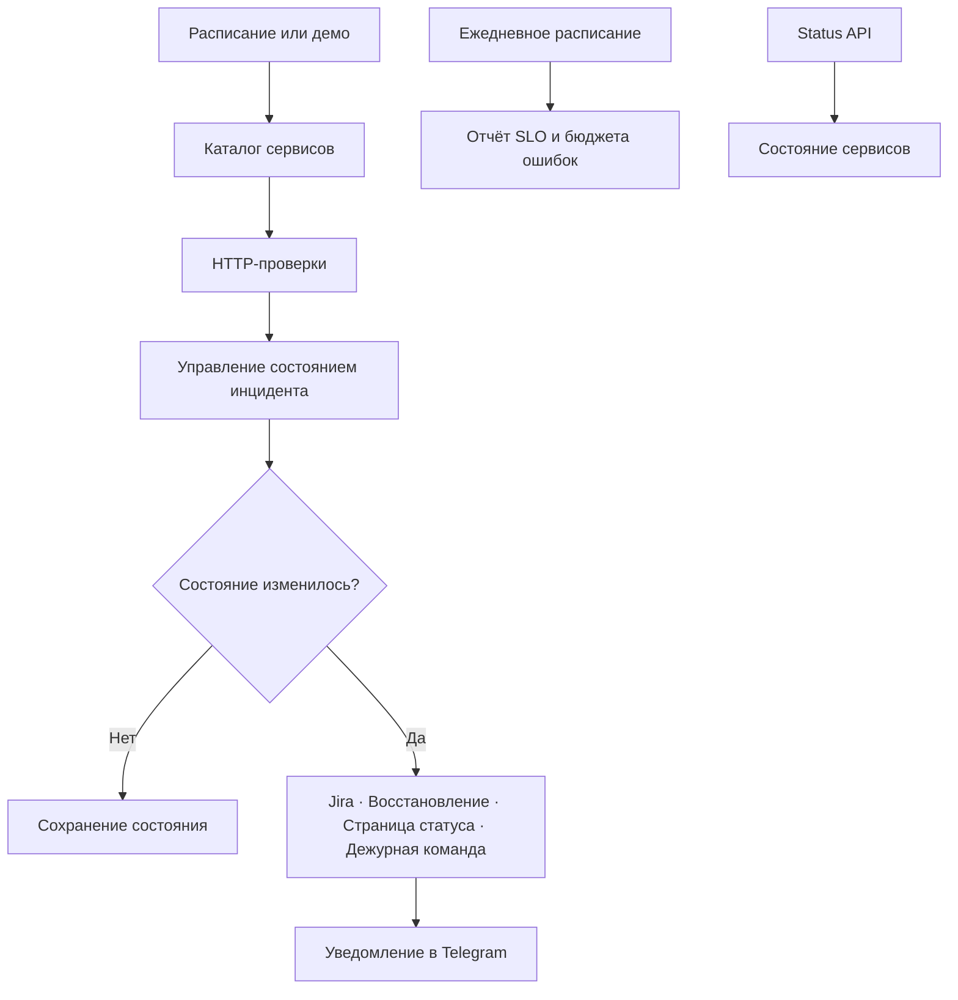

# PulseOps — центр управления надёжностью API

[English version](README.md) · [Архитектура](docs/ARCHITECTURE.md) · [Настройка](docs/SETUP.md) · [Структура данных](docs/DATA_CONTRACTS.md)

Workflow n8n для мониторинга API, управления жизненным циклом инцидентов, запуска восстановления, обновления страницы статуса, эскалации и ежедневной отчётности по SLO.

## Что делает workflow

- проверяет настраиваемый список HTTP-сервисов;
- использует пороги последовательных ошибок и успешных ответов, чтобы не создавать лишние уведомления;
- хранит отдельное состояние инцидента для каждого сервиса;
- создаёт и закрывает задачи Jira;
- запускает сценарии восстановления;
- создаёт и закрывает инциденты на странице статуса;
- эскалирует длительные сбои дежурной команде;
- отправляет уведомления об инцидентах и восстановлении в Telegram;
- предоставляет защищённый endpoint с текущим состоянием;
- формирует ежедневный отчёт по SLO и бюджету ошибок.

## Архитектура



## Демонстрационный запуск

После импорта оставьте `PULSEOPS_DEMO_MODE` пустым или установите `true`.

1. Запустите **Demo: Run Incident Cycle** для обработки пяти условных сервисов.
2. Запустите **Demo: Run Daily Digest** для формирования дневных метрик.

Демонстрация создаёт событие сбоя, восстановления и повышенной задержки без обращения к внешним системам.

## Правила обработки инцидентов

| Ситуация | Результат |
| --- | --- |
| Первая ошибка | Сервис получает состояние `degraded` |
| Достигнут порог ошибок | Сервис получает состояние `down`, создаётся инцидент |
| Успешный ответ во время сбоя | Увеличивается счётчик восстановления |
| Достигнут порог восстановления | Инцидент закрывается |
| Медленный успешный ответ | Событие `performance_degraded` |
| Длительный сбой | Эскалация дежурной команде |
| Состояние не изменилось | Состояние сохраняется без повторного уведомления |

## Настройка

1. Импортируйте [`workflows/pulseops-api-reliability-control-tower.json`](workflows/pulseops-api-reliability-control-tower.json) в n8n.
2. Добавьте переменные `PULSEOPS_*` по инструкции [SETUP.md](docs/SETUP.md).
3. Назначьте credentials для Jira, Telegram, сценариев восстановления, страницы статуса, дежурной команды и Status API.
4. Замените пример каталога сервисов.
5. Установите `PULSEOPS_DEMO_MODE=false` и проверьте расписания перед активацией.

## Структура репозитория

```text
workflows/       файл workflow n8n
sample-data/     пример каталога и результатов
docs/            архитектура, настройка и структура данных
scripts/         локальные технические проверки
tests/           автоматические тесты
```

## Лицензия

MIT — см. [LICENSE](LICENSE).
