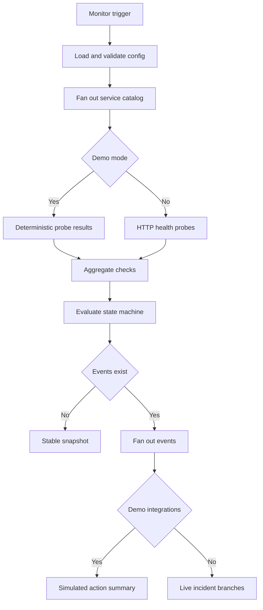
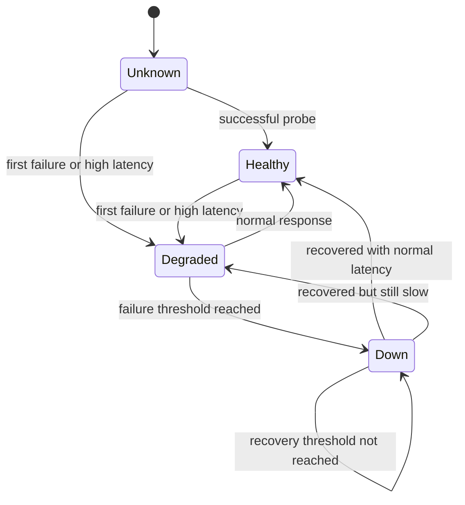
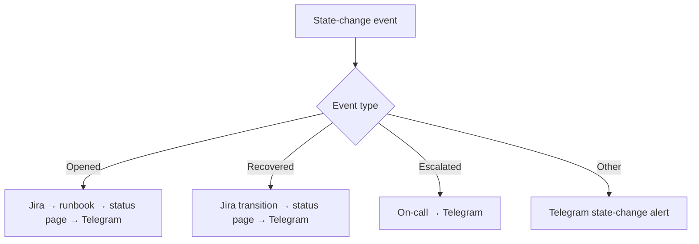

# Architecture

PulseOps is one n8n workflow with five independent entry points and two scheduled jobs. Monitoring, reporting, status access, and provider-specific actions are separated into explicit branches.

## Entry points

| Entry point | Purpose | External calls in demo mode |
| --- | --- | ---: |
| `Demo: Run Incident Cycle` | Deterministic monitoring scenario | 0 |
| `Schedule: Monitor Every 5 Minutes` | Live service monitoring | Depends on mode |
| `Demo: Run Daily Digest` | Deterministic SLO report | 0 |
| `Schedule: Daily SLO Digest (09:00 UTC)` | Previous UTC day's report | Depends on mode |
| `API: Current Reliability Status` | Read persisted state | 0 |

The status API is independent of runtime configuration and requires a Header Auth credential.

## Monitoring flow



The workflow aggregates the entire service batch before it mutates state. The aggregate contains availability, p50 latency, p95 latency, and normalized check records. Only state changes become notification events.

## Incident state machine



State transitions emit the following event types:

| Event | When emitted | Main actions |
| --- | --- | --- |
| `incident_opened` | State enters `down` | Jira create, optional runbook, status-page open, Telegram |
| `incident_recovered` | State exits `down` | Jira transition, status-page resolve, Telegram |
| `service_degraded` | First failed check | Telegram |
| `performance_degraded` | Successful response exceeds threshold | Telegram |
| `service_recovered` | `degraded` returns to `healthy` | Telegram |
| `incident_escalated` | Outage exceeds configured duration | On-call trigger, Telegram |

## Hysteresis and deduplication

Each service has independent failure and success counters. A first failure does not open an outage. An outage does not close after a single successful check. This gives the workflow two-sided hysteresis and reduces alert flapping.

The state record also contains one active `incident_id`. A new Jira issue is created only when the state crosses into `down`, not on every failed probe.

## Persisted state

The demo uses fixture state and never writes operational state. Live mode uses `getWorkflowStaticData('global')` with two namespaces:

```json
{
  "pulseops_state": {
    "checkout-api": {
      "state": "down",
      "incident_id": "inc_checkout-api_1788710400000",
      "jira_issue_key": "OPS-100",
      "status_page_incident_id": "STATUS-100",
      "down_since": 1788710400000,
      "escalated": false,
      "last_escalation_attempt_at": null
    }
  },
  "pulseops_metrics": {
    "2026-09-06": {
      "checkout-api": {
        "checks": 288,
        "successes": 287,
        "failures": 1,
        "latencies": [180, 220, 260],
        "incidents": 1,
        "recoveries": 1
      }
    }
  }
}
```

`jira_issue_key` and `status_page_incident_id` are cleared from the active state only after they have been copied onto the recovery event. This prevents a new outage from inheriting identifiers from an older incident.

Daily metric keys older than `PULSEOPS_METRICS_RETENTION_DAYS` are removed during live monitoring runs. Per-service latency arrays are capped by `PULSEOPS_ROLLING_SAMPLE_LIMIT`.

## Live incident branches



All provider HTTP nodes request the full response and use `Never Error`, while the n8n node error policy continues regular output. Downstream Code nodes inspect the HTTP status and error object. This design distinguishes:

- workflow logic completed successfully;
- provider accepted the action;
- provider action failed but the remaining notification path still ran.

A returned `success: false` therefore means at least one integration failed, not that the state transition was lost.

## Escalation retry

The state machine writes `last_escalation_attempt_at` when it emits an escalation. The on-call result handler sets `escalated=true` only when the provider accepts the request. A failure keeps `escalated=false`, so another event becomes eligible after `PULSEOPS_ESCALATION_RETRY_MINUTES`. This provides retry without alerting on every five-minute cycle.

## Daily SLO branch

The digest reads the previous UTC calendar day's metrics and calculates, per service:

- total checks;
- availability percentage;
- p95 latency from retained samples;
- incident and recovery counts;
- SLO result;
- error-budget consumption.

Telegram text is limited to the configured payload length. The complete service array remains in the Code node output even if the message preview is truncated.

## Status API

The read-only status webhook returns counts, active incidents, and a compact service list. It does not return configuration, provider credentials, response bodies, or the raw static-data object.

## Production scaling boundary

Workflow static data supports the included demo and a modest single-worker deployment. For queue mode, multiple workers, or high-frequency checks:

1. store service state and metrics in PostgreSQL or Redis;
2. use a distributed lock or unique incident constraint per service;
3. move time-series reporting to a metrics backend;
4. add provider-specific retry queues and dead-letter handling;
5. apply network egress allowlists outside n8n.

The official n8n documentation also notes that static-data persistence behaves differently in manual testing and requires an active triggered workflow: [getWorkflowStaticData](https://docs.n8n.io/build/code-in-n8n/cookbook/built-in-methods-and-variables-examples/getworkflowstaticdata/).

Runtime configuration is resolved in this order: n8n Variables, permitted self-hosted environment access, then the explicit non-secret fallback blocks inside the two configuration Code nodes. Demo mode remains the default until live configuration is supplied.
